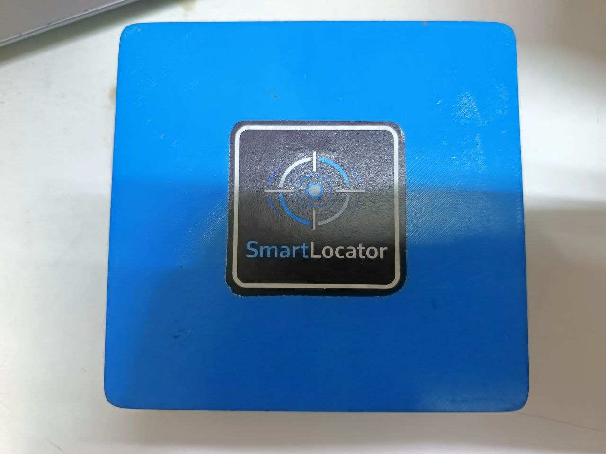
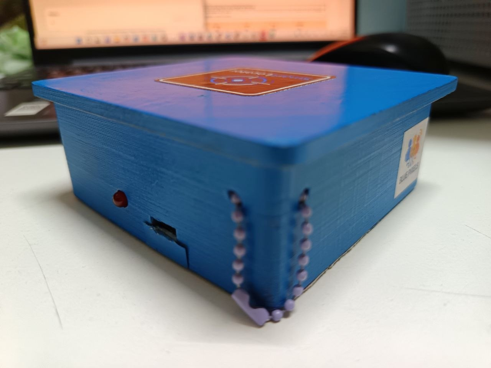
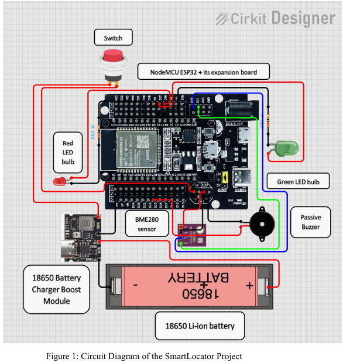
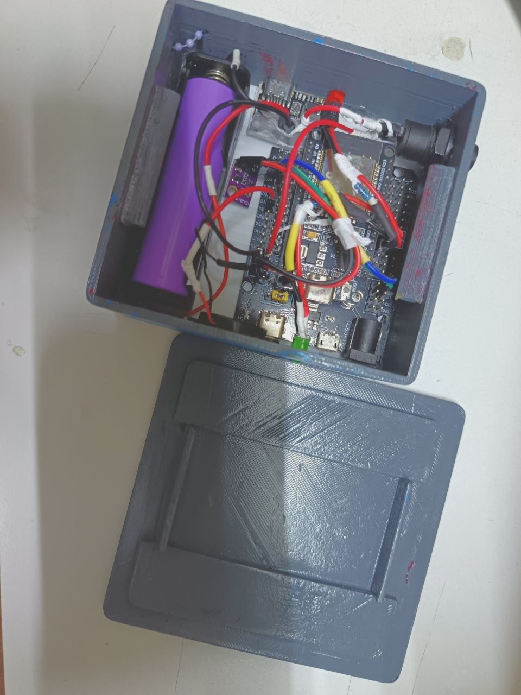
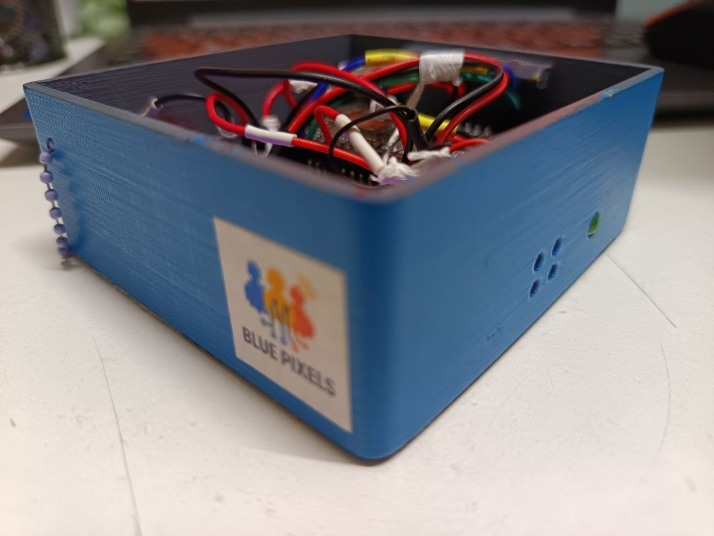
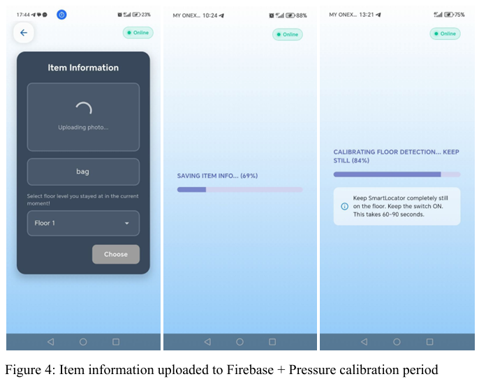
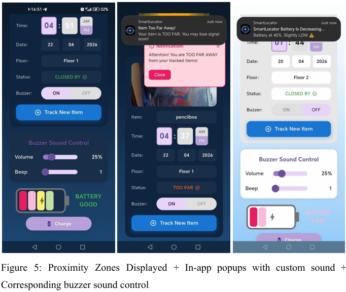
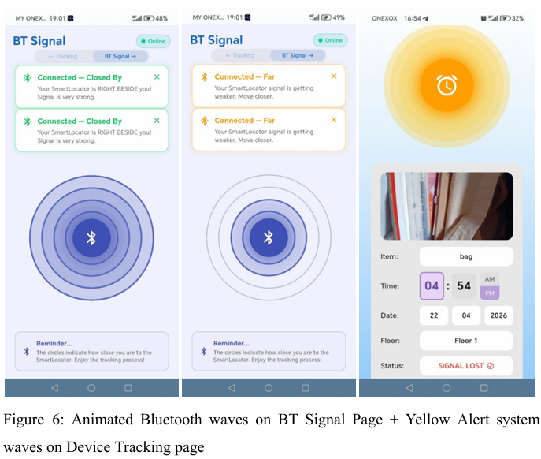
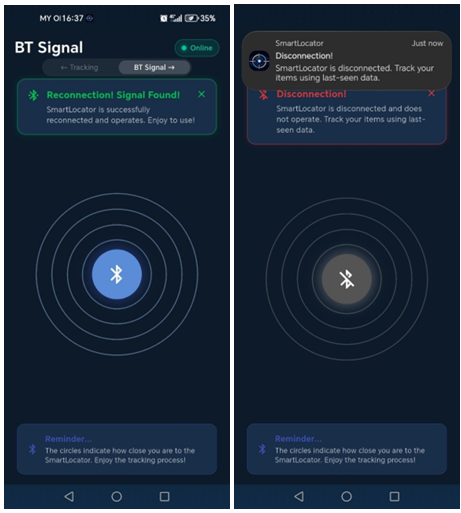

# SmartLocator (BluePixels)

An IoT item tracker that warns you **before** you lose your belongings, instead of only helping you search after they are lost.

Built for students at Johor Matriculation College (KMJ) who often misplace **personal belongings** such as bags, pencil boxes and other items in dormitories. The device sits with your item, measures how far your phone is using Bluetooth Low Energy (BLE), and alerts you with a buzzer and phone notifications when you start moving away. A barometric sensor also tells you which floor the item is on.

<p align="center">
  
  
</p>

> Final project for **CT125 Digital Technology**
---

## Features

| Feature | What it does |
|---|---|
| **BLE proximity alerts** | Classifies signal strength (RSSI) into 5 zones and triggers alerts when the zone changes |
| **Floor detection** | BME280 pressure sensor detects floor level from Ground to Floor 4 using pressure *differences* |
| **Multi-channel alerts** | Passive buzzer + Android push notification + in-app popup + animated signal waves, all in sync |
| **Adjustable buzzer** | Volume and beep count can be changed from the app |
| **Last-seen data** | Floor, zone, battery and time are saved to Firebase when the connection drops |
| **Auto-reconnect** | App retries the BLE connection by itself every few seconds |
| **Tracking history and dashboard** | History log and bar charts, stored per user in Firebase |
| **Battery indicator** | Timer-based estimate shown as GOOD / NORMAL / LOW, plus a red LED at 20% or below |
| **Portable and rechargeable** | 18650 Li-ion cell with a USB-C charge and 5V boost module, in a 3D-printed snap-fit case |

---

## How it works

```
 ┌──────────────────────────┐     BLE (Nordic UART)      ┌──────────────────────────┐
 │  SmartLocator device     │ ◄────────────────────────► │  Flutter Android app     │
 │  ESP32 + BME280 + buzzer │   JSON stream every 1 s    │  flutter_blue_plus       │
 └──────────────────────────┘   + text commands          └────────────┬─────────────┘
                                                                       │ Wi-Fi / mobile data
                                                          ┌────────────▼─────────────┐
                                                          │ Firebase                 │
                                                          │ Auth, Realtime DB,       │
                                                          │ Storage                  │
                                                          └──────────────────────────┘
```

**System 1: Early BLE proximity alert.** The ESP32 reads RSSI, smooths it with a 5-sample moving average, and maps it to a zone. The app also reads RSSI every 2 seconds and applies a 2-second debounce before firing alerts.

**System 2: Barometric floor detection.** The user picks their current floor, the device waits until the pressure is stable, and then saves that pressure as a *dynamic baseline*. Floor changes are worked out from the difference against this baseline, not from absolute pressure (which drifts with weather).

### Proximity zones

| RSSI (dBm) | Zone | Buzzer beeps | Volume |
|---|---|---|---|
| >= -55 | CLOSED BY | 1 | 25% |
| >= -70 | NEARBY | 1 | 25% |
| >= -80 | FAR | 2 | 50% |
| >= -95 | TOO FAR | 3 | 75% |
| < -95 | SIGNAL LOST | 3 | 100% |

> RSSI is noisy indoors, so the system reports **zones, not metres**.

### Floor detection settings

- 3-stage software filter on top of the sensor's built-in oversampling x16 and IIR x16: **Median(7) → Moving Average(15) → EMA(alpha = 0.25)**
- Calibration only completes when all three conditions are met: at least 80 samples, pressure range under 0.1 hPa, and standard deviation under 0.03 hPa (about 60 to 90 seconds)
- About 0.20 to 0.50 hPa per floor. A pressure drop means the device moved up, and a rise means it moved down

---

## Hardware

| Component | Role | Pin / note |
|---|---|---|
| NodeMCU ESP32 + expansion board | Main controller, BLE | |
| GY-BME280 | Barometric pressure (floor detection) | I2C, read every 500 ms |
| Passive buzzer | Audible proximity alerts | GPIO25 (LEDC PWM) |
| Green LED | Power / system-on indicator | GPIO17 |
| Red LED | Low battery indicator | GPIO16 |
| Hardware switch | Physically cuts power to the circuit | |
| 18650 Li-ion cell (3.7 V) + holder | Power source | |
| 18650 charger + 5V boost module (USB-C) | Charging and stable 5 V output | |
| 3D-printed snap-fit casing | Enclosure (designed in TinkerCad) | |

### Circuit diagram



### Prototype

<p align="center">
  
  
</p>

---

## Software stack

| Part | Tools |
|---|---|
| Firmware | Arduino IDE 2.x, ESP32 board package, C/C++ |
| Mobile app | Flutter (Android only), Dart |
| Backend | Firebase Authentication, Realtime Database, Firebase Storage |
| Key Flutter packages | `flutter_blue_plus`, `firebase_auth`, `firebase_database`, `firebase_storage`, `flutter_local_notifications`, `hive`, `shared_preferences`, `image_picker`, `tutorial_coach_mark` |
| Android build | Gradle Kotlin DSL (`.kts`), AGP 8.6+, Kotlin 2.1 |
| Testing tools | Serial Bluetooth Terminal (BLE mode), Android Studio logcat |

---

## Repository structure

```
.
├── app/                         Flutter Android app
│   ├── lib/                     Dart source (pages, services, theme)
│   │   └── services/            ble_service.dart, auth_service.dart
│   ├── android/                 Android project
│   ├── assets/                  Fonts and images
│   └── pubspec.yaml
├── firmware/
│   ├── Smartlocator_combined/   Main ESP32 firmware
│   ├── RSSIrecordBLE/           Test sketch: RSSI recording
│   └── pressurerecordBLEREAL/   Test sketch: pressure recording
├── .gitignore
└── README.md
```

---

## Getting started

### Files that are NOT in this repo (on purpose)

These are kept out for security. You need to create them yourself:

| File | Where it goes |
|---|---|
| `google-services.json` | `app/android/app/` |
| `firebase_options.dart` (only if the app imports it) | `app/lib/` |
| Signing keys (`*.jks`, `key.properties`) | Only needed for release builds |
| `secrets.h` (if used) | Next to the `.ino` file |

### 1. Firmware (ESP32)

1. Install **Arduino IDE 2.x** and add the **ESP32** board package (Boards Manager). The code uses the pin-based LEDC API, so use board package **3.x**.
2. Install these libraries (Library Manager):
   - Adafruit BME280 Library
   - Adafruit Unified Sensor
   - The ESP32 BLE library comes with the board package
3. Open `firmware/Smartlocator_combined/Smartlocator_combined.ino`.
4. Select your ESP32 board and port, then **Upload**.
5. (Optional) Test with the *Serial Bluetooth Terminal* app in BLE mode before using the Flutter app.

### 2. Firebase

1. Create a Firebase project and enable **Authentication**, **Realtime Database** and **Storage**.
2. Add an **Android app** with the package name `com.example.smartlocator_bluepixels`.
3. Download `google-services.json` and put it in `app/android/app/`.
4. If the app needs `firebase_options.dart`, generate it with:
   ```bash
   dart pub global activate flutterfire_cli
   flutterfire configure
   ```
5. Set the Realtime Database rules so each user can only access their own data:
   ```json
   {
     "rules": {
       "users": {
         "$uid": {
           ".read": "auth != null && auth.uid === $uid",
           ".write": "auth != null && auth.uid === $uid"
         }
       },
       "feedback": {
         "$uid": {
           ".read": "auth != null && auth.uid === $uid",
           ".write": "auth != null && auth.uid === $uid"
         }
       }
     }
   }
   ```

Data layout: `users/{uid}/history`, `users/{uid}/lastSeen`, `feedback/{uid}`.

### 3. Flutter app

```bash
cd app
flutter pub get
flutter run
```

- Use a **real Android phone**. BLE does not work on the emulator.
- Allow the Bluetooth and notification permissions when asked.

---

## BLE protocol

The ESP32 uses the **Nordic UART Service (NUS)**:

| Item | UUID |
|---|---|
| Service | `6E400001-B5A3-F393-E0A9-E50E24DCCA9E` |
| TX (ESP32 to app) | `6E400003-...` |
| RX (app to ESP32) | `6E400002-...` |

- ESP32 to app: a **JSON status stream every second** (zone, floor, battery, calibration progress, etc.)
- App to ESP32: short text commands, for example `ITEM:<name>`, `FLOOR:<n>`, `BATT:RESET`, plus buzzer beep/volume and time-sync commands
- Writes use `withoutResponse: true`. Using `false` makes Android bond with the ESP32, which then silently blocks writes.

---

## Screenshots

| Item upload & calibration | Tracking status |
|---|---|
|  |  |

| BT signal & buzzer alerts | Reconnect & disconnect |
|---|---|
|  |  |

---

## Test results (summary)

Floor detection delay, from the project report:

| Condition | Movement | Average delay | Range |
|---|---|---|---|
| Normal weather | 1 floor | 14 s | 10 to 19 s |
| Normal weather | 2+/3+ floors | 32 s | 27 to 38 s |
| Rainy + windy | 1 floor | 15 s | 10 to 18 s |
| Rainy + windy | 2+/3+ floors | 40 s | 35 to 46 s |

All floor-detection tests passed. Other measured times: BLE auto-reconnect about 5 s, live status update 1 s, last-seen save under 2 s.

---

## Known limitations

- BLE RSSI gives **zones, not exact distance** (walls, furniture and people change the signal).
- Battery level is a **timer-based estimate** (no voltage divider or fuel gauge), so it shows labels, not an exact percentage.
- Floor detection needs a **60 to 90 seconds calibration** while the device is kept still.
- The casing is too big for very small items such as keys or wallets.
- Only partially water resistant (small vent holes for the sensor and BLE signal).
- Android only.

## Future work

Smaller ESP32-Mini version, GPS and GSM/LTE for outdoor tracking, motion sensor for theft alerts, louder alarm, and extending the system to vehicles.

---

## Credits

Team **BluePixels** · CT125 Digital Technology · Johor Matriculation College (KMJ)

## License

Academic project. No open-source license has been added yet.